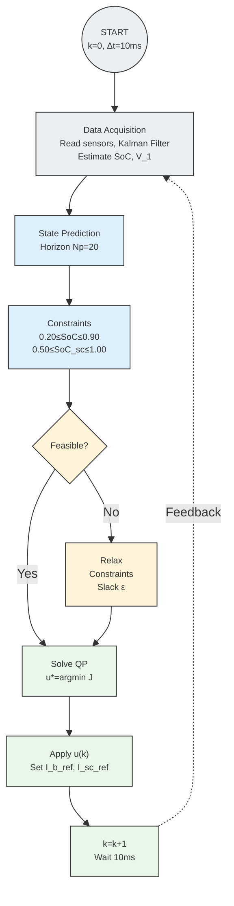

# Architecture Overview — MPC Real-Time Loop

Compact flowchart for battery + ultracapacitor energy management MPC control loop.

## Legend
- **Light Grey**: Perception & State Estimation
- **Light Blue**: Mathematical Operations
- **Light Amber**: Decision & Constraint Relaxation
- **Light Green**: Optimization & Actuation
- **Dashed line**: Feedback loop (10ms cycle)

## Key Components
| Block | Function |
|-------|----------|
| **B1** | Timer interrupt trigger (100 Hz) |
| **B2** | ADC sampling + Kalman filter observer |
| **B3** | State trajectory prediction (200 ms horizon) |
| **B4** | Physical constraint formulation |
| **B5** | QP feasibility check |
| **B6** | Soft constraint relaxation with slack variable |
| **B7** | Active-set QP solver (Nc=5) |
| **B8** | Receding horizon execution |
| **B9** | Horizon shift + wait for next interrupt |
