# Architecture Overview — MPC Real-Time Loop

This file contains a vertical flowchart (Mermaid) showing the architecture overview of the real-time MPC loop for battery + ultracapacitor energy management. Colors follow a pastel palette and variables are italicized for an academic look.

```mermaid
flowchart TD
  %% Layout: Top-to-bottom
  %% Nodes
  B1(("START (Timer Interrupt Trigger)<br><br>Initialize: <i>k</i> = 0<br>Sampling Time: <i>Δt</i> = 10 ms<br><br><i>Technical Context:</i> The real-time task scheduler triggers this function block precisely every 10 ms (100 Hz).")) 
  B2["Data Acquisition & State Estimation<br><br>1. Read sensor outputs via ADC:<br>&nbsp;&nbsp;V_bat(<i>k</i>), I_bat(<i>k</i>), V_sc(<i>k</i>), v_vehicle(<i>k</i>)<br>2. Run State Observers (Kalman Filter):<br>&nbsp;&nbsp;Estimate SoC(<i>k</i>), SoC_sc(<i>k</i>), polarization voltage V_1(<i>k</i>)<br>3. Calculate traction load demand: P_dem(<i>k</i>)<br><br><i>Technical Context:</i> Sampled signals → state vector x(<i>k</i>) = [SoC(<i>k</i>); SoC_sc(<i>k</i>); V_1(<i>k</i>)]^T and disturbance d(<i>k</i>) = P_dem(<i>k</i>)."]
  B3["State Trajectory Prediction<br><br>Predict system state trajectories over Horizon Np = 20<br><br>Using Discrete State-Space Plant Model:<br>x(<i>k</i>+j+1|<i>k</i>) = A_d * x(<i>k</i>+j|<i>k</i>) + B_d * u(<i>k</i>+j|<i>k</i>) + E_d * d(<i>k</i>+j|<i>k</i>)<br><br><i>Technical Context:</i> Forecast next 200 ms (20 steps × 10 ms)."]
  B4["Constraints Mapping<br><br>Formulate Hard Inequality Constraint Matrices:<br>A_ineq * U(<i>k</i>) <= B_ineq(<i>k</i>)<br><br>Bounds:<br>- 0.20 <= SoC(<i>k</i>+j) <= 0.90<br>- 0.50 <= SoC_sc(<i>k</i>+j) <= 1.00<br>- I_b_min <= I_b(<i>k</i>+j) <= I_b_max<br><br><i>Technical Context:</i> Physical bounds cast into linear inequalities."]
  B5{Is the QP Optimization<br>Problem Feasible?}
  B6["Soft Constraint Relaxation<br><br>Activate Soft Constraints:<br>1. Introduce Slack Variable (ε)<br>2. Apply Quadratic Penalty (ρ * ε^2) to Cost Function J(<i>k</i>)<br><br><i>Technical Context:</i> If transients violate hard bounds, relax them with penalized slack to avoid solver stalls."]
  B7["Solve Constrained Optimization (QP Solver)<br><br>Solve Constrained Quadratic Programming (QP):<br>u*(<i>k</i>) = arg min J(<i>k</i>) subject to constraints<br>Compute optimal control vector:<br>U*(<i>k</i>) = [u*(<i>k</i>|<i>k</i>), u*(<i>k</i>+1|<i>k</i>), ..., u*(<i>k</i>+N_c-1|<i>k</i>)]^T<br><br><i>Technical Context:</i> Active-set solver → control horizon N_c = 5."]
  B8["Receding Horizon Execution<br><br>Apply first element of optimal control sequence:<br>u(<i>k</i>) = u*(<i>k</i>|<i>k</i>)<br>Set current loop references for 20 kHz PI controllers:<br>I_b_ref(<i>k</i>) = u*(1), &nbsp; I_sc_ref(<i>k</i>) = u*(2)<br><br><i>Technical Context:</i> Only immediate action implemented for robustness."]
  B9["Shift Horizon Window<br><br>Increment time index: <i>k</i> = <i>k</i> + 1<br>Wait for next Timer Interrupt (10 ms)<br><br><i>Feedback:</i> return to Data Acquisition & State Estimation to continue the real-time loop."]

  %% Connections (vertical flow)
  B1 --> B2
  B2 --> B3
  B3 --> B4
  B4 --> B5
  B5 -- Yes --> B7
  B5 -- No --> B6
  B6 --> B7
  B7 --> B8
  B8 --> B9
  %% Feedback loop from B9 back to B2
  B9 -. Feedback loop .-> B2

  %% Styling: pastel palette, sans-serif, italic variables handled inline with <i>...</i>
  classDef statesClass fill:#ECEFF1,stroke:#666,stroke-width:1px,font-family:Arial, font-size:12px;
  classDef mathClass fill:#DDEFFB,stroke:#666,stroke-width:1px,font-family:Arial, font-size:12px;
  classDef decisionClass fill:#FFF3D9,stroke:#666,stroke-width:1px,font-family:Arial, font-size:12px;
  classDef optClass fill:#E8F7E9,stroke:#666,stroke-width:1px,font-family:Arial, font-size:12px;

  class B1,B2 statesClass
  class B3,B4 mathClass
  class B5,B6 decisionClass
  class B7,B8,B9 optClass

  %% Link style to make feedback visually distinct
  linkStyle default stroke:#666, stroke-width:1px
  linkStyle 8 stroke-dasharray: 5 5, stroke:#4B4B4B
```

## Legend

- **Colors**: Pastel slate (perception & states), pastel blue (mathematical ops), pastel amber (decision & slack), pastel green (optimization & actuation).
- **Fonts**: Sans-serif (Arial). Variables such as *k*, *Δt*, *SoC*, *P_dem* are italicized inline for an academic look.

## Notes / Usage

- The Mermaid diagram flows top-to-bottom (TD) and includes a feedback loop from the Shift Horizon step back to Data Acquisition to represent continuous real-time execution.
- Node text preserves the technical context describing each block in the MPC control loop.
- If you need modifications (e.g., expand equations, add code references, or include PI controller details), let me know which sections to adjust.
